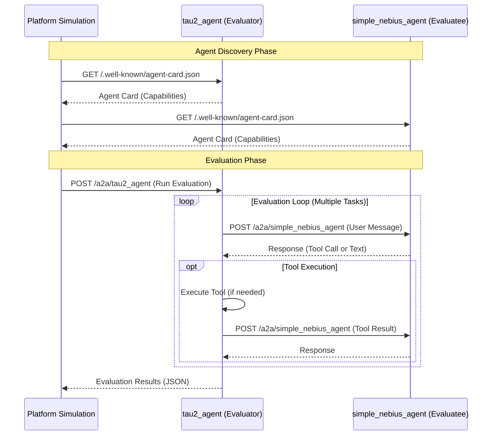

# tau2-agent: A2A Integration for tau2-bench

Fork of [tau2-bench](https://github.com/sierra-research/tau2-bench) adding [A2A Protocol](https://a2a-protocol.org/) and [Google ADK](https://github.com/google/adk-python) support for remote agent evaluation.

---

## Quick Start

```bash
# 1. Setup
python -m venv venv && source venv/bin/activate
pip install -e .

# 2. Configure API key (get from https://tokenfactory.nebius.com/)
cp .env.example .env
# Edit .env with your NEBIUS_API_KEY

# 3. Run evaluation
./specs/001-a2a-integration/scripts/test_simple_agent.sh
```

---

## What's Different

This fork adds:

- **A2A Protocol Support** - Evaluate remote agents via [JSON-RPC 2.0 A2A protocol](https://a2a-protocol.org/latest/)
- **tau2_agent** - ADK-powered evaluation service exposing tau2-bench as an A2A agent
- **A2AAgent** - Client adapter for evaluating A2A-compliant agents
- **Platform Simulation** - A2A-to-A2A evaluation flow demonstration

### Architecture



---

## Usage

### Evaluate a Remote A2A Agent

```bash
tau2 run airline \
  --agent a2a_agent \
  --agent-a2a-endpoint https://your-agent.example.com \
  --user-llm gpt-4o
```

### Run Platform Simulation (A2A-to-A2A)

```bash
# Terminal 1: Start ADK server
adk api_server --a2a . --port 8001

# Terminal 2: Run simulation
python specs/001-a2a-integration/scripts/platform_simulation.py --domain mock --num-tasks 2
```

### Domain Evaluation

```bash
./specs/001-a2a-integration/scripts/eval_domain.sh telecom 1 5  # domain, trials, tasks
```

### CLI Arguments

| Argument | Purpose |
|----------|---------|
| `--agent a2a_agent` | Enable A2A agent mode |
| `--agent-a2a-endpoint URL` | Remote agent endpoint |
| `--agent-a2a-auth-token TOKEN` | Bearer token (optional) |
| `--agent-a2a-timeout SECONDS` | Request timeout (default: 300) |

---

## Key Components

| Component | File | Purpose |
|-----------|------|---------|
| `tau2_agent` | [tau2_agent/agent.py](tau2_agent/agent.py) | ADK LlmAgent exposing tau2 tools |
| `A2AAgent` | [src/tau2/agent/a2a_agent.py](src/tau2/agent/a2a_agent.py) | Adapter for evaluating A2A agents |
| `A2AClient` | [src/tau2/a2a/client.py](src/tau2/a2a/client.py) | HTTP client for A2A protocol |

---

## Documentation

- **[A2A Quickstart Guide](specs/001-a2a-integration/quickstart.md)** - Tutorial with architecture diagrams
- **[Sequence Diagrams](specs/001-a2a-integration/sequence_diagrams.md)** - Threading and sync-async bridge details
- **[A2A Protocol Spec](https://a2a-protocol.org/latest/)** | **[a2a-python SDK](https://github.com/a2aproject/a2a-python)**
- **[Google ADK](https://github.com/google/adk-python)**

---

## Original tau2-bench

For full tau2-bench documentation (domains, leaderboard, gym mode, RL training), see the [upstream repository](https://github.com/sierra-research/tau2-bench).

### Available Domains

- `mock` - Simple test scenarios
- `airline` - Flight booking, modifications, cancellations
- `retail` - Product orders, returns, exchanges
- `telecom` - Technical support, billing issues

### Citation

```bibtex
@misc{barres2025tau2,
      title={$\tau^2$-Bench: Evaluating Conversational Agents in a Dual-Control Environment},
      author={Victor Barres and Honghua Dong and Soham Ray and Xujie Si and Karthik Narasimhan},
      year={2025},
      eprint={2506.07982},
      archivePrefix={arXiv},
      primaryClass={cs.AI},
      url={https://arxiv.org/abs/2506.07982},
}
```
