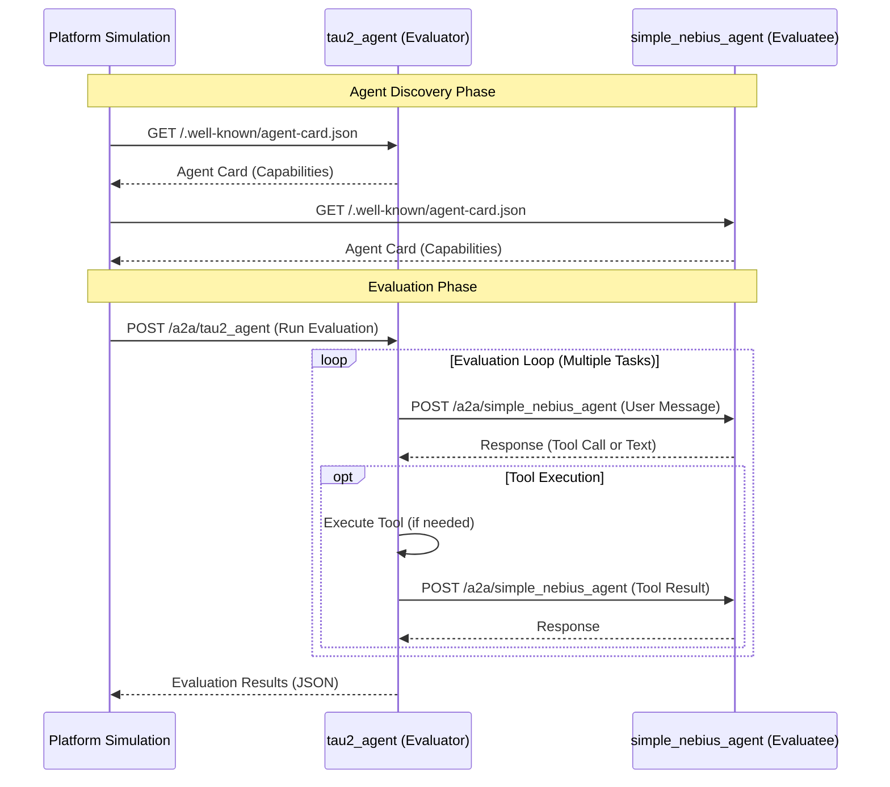

# tau2-agent: A2A Integration for tau2-bench

Fork of [tau2-bench](https://github.com/sierra-research/tau2-bench) adding [A2A Protocol](https://a2a-protocol.org/) and [Google ADK](https://github.com/google/adk-python) support for remote agent evaluation.

[](https://www.python.org)
[](https://github.com/astral-sh/ruff)
[](https://arxiv.org/abs/2506.07982)
[](https://sierra.ai/blog/benchmarking-agents-in-collaborative-real-world-scenarios)
[](https://x.com/SierraPlatform/status/1932464265207889974)
[](https://www.linkedin.com/posts/sierra_last-year-we-introduced-%F0%9D%9C%8F-bench-a-benchmark-activity-7338229693898231809-F8L4?utm_source=share&utm_medium=member_desktop&rcm=ACoAAAdc8goBmhEsiEo1_t_XSJbAnY4_zMfAWcE)
[](https://taubench.com)

<div align="center">

</div>

<div align="center">
<h3>🚀 τ³-bench is here!</h3>
<p>From text-only to multimodal, knowledge-aware agent evaluation.<br>
Voice full-duplex · Knowledge retrieval · 75+ task fixes<br>
<a href="https://arxiv.org/abs/2603.13686">τ-Voice paper</a> · <a href="https://arxiv.org/abs/2603.04370">τ-Knowledge paper</a> · <a href="https://arxiv.org/abs/2512.07850">Task fixes paper</a> · <a href="https://github.com/sierra-research/tau2-bench/releases/tag/v1.0.0">Release notes</a></p>
</div>

> **How do you say $\tau^3$-bench?** We just say "tau three," but you do you!

## What's New in $\tau^3$-bench

- **Knowledge Domain (`banking_knowledge`)** — A knowledge-retrieval-based customer service domain with configurable RAG pipelines, document search, embeddings, and agentic shell-based search. [Learn more →](src/tau2/knowledge/README.md)
- **Voice Full-Duplex (Audio Native)** — End-to-end voice evaluation with realtime providers (OpenAI, Gemini, xAI). [Learn more →](src/tau2/voice/README.md)
- **Task Quality (75+ fixes)** — Removed incorrect expected actions, clarified ambiguous instructions, fixed impossible constraints, and added missing fallback behaviors across airline, retail, and banking domains. Based on analysis from [SABER](https://arxiv.org/abs/2512.07850) (Cuadron et al., 2025). [Learn more →](https://taubench.com/blog/tau3-task-fixes.html)
- **Updated Leaderboard** — Now includes voice and knowledge results. Compare model performance at [taubench.com](https://taubench.com). [Submit your results →](docs/leaderboard-submission.md)

See [CHANGELOG.md](CHANGELOG.md) for the full version history.

> **Backward compatibility note**: If you are evaluating an agent (not training), use the `base` task split to evaluate on the complete task set that matches the original τ-bench structure. This is the default.

> **Upgrading from $\tau^2$-bench?** Installation now uses `uv` instead of `pip install -e .`, and Python `>=3.12, <3.14` is required (was `>=3.10`). Some internal APIs have been refactored — see [CHANGELOG.md](CHANGELOG.md) for details.

## Overview

$\tau$-bench is a simulation framework for evaluating customer service agents across multiple domains. It supports text-based half-duplex (turn-based) evaluation and voice full-duplex (simultaneous) evaluation using real-time audio APIs.

Each domain specifies:
- A **policy** that the agent must follow
- A set of **tools** that the agent can use
- A set of **tasks** to evaluate the agent's performance
- Optionally: a set of **user tools** for the user simulator

**Available domains**: `mock` · `airline` · `retail` · `telecom` · `banking_knowledge`

| Mode | Description |
|------|-------------|
| **Text (half-duplex)** | Turn-based chat with tool use |
| **Voice (full-duplex)** | End-to-end audio via realtime providers (OpenAI, Gemini, xAI) |

## Quick Start (Upstream tau2-bench)

### 1. Install

```bash
git clone https://github.com/sierra-research/tau2-bench
cd tau2-bench
uv sync                        # core only (text-mode: airline, retail, telecom, mock)
```

Optional extras (install what you need):

```bash
uv sync --extra voice          # + voice/audio-native features
uv sync --extra knowledge      # + banking_knowledge domain (retrieval pipeline)
uv sync --extra gym            # + gymnasium RL interface
uv sync --extra dev            # + pytest, ruff, pre-commit (required for contributing)
uv sync --all-extras           # everything
```

This requires [uv](https://docs.astral.sh/uv/getting-started/installation/). Voice features also need system dependencies (`brew install portaudio ffmpeg` on macOS). See the [full installation guide](docs/getting-started.md) for details.

### 2. Set up API keys

```bash
cp .env.example .env
# Edit .env with your API keys (uses LiteLLM — any supported provider works)
```

### 3. Run an evaluation

```bash
tau2 run --domain airline --agent-llm gpt-4.1 --user-llm gpt-4.1 \
  --num-trials 1 --num-tasks 5
```

Results are saved to `data/simulations/`. Use `tau2 view` to browse them.

> **Tip**: Run `tau2 intro` for an overview of available domains, commands, and examples.

## Quick Start (A2A Fork)

### Option 1: Using uv (Recommended)

```bash
# 1. Install uv (if not already installed)
curl -LsSf https://astral.sh/uv/install.sh | sh

# 2. Setup project and install dependencies
uv sync

# 3. Configure API key (get from https://tokenfactory.nebius.com/)
cp .env.example .env
# Edit .env with your NEBIUS_API_KEY

# 4. Start ADK server (serves both agents)
uv run adk api_server --a2a . --port 8001
```

### Option 2: Using pip

```bash
# 1. Setup
python -m venv venv && source venv/bin/activate
pip install -e .

# 2. Configure API key (get from https://tokenfactory.nebius.com/)
cp .env.example .env
# Edit .env with your NEBIUS_API_KEY

# 3. Start ADK server (serves both agents)
adk api_server --a2a . --port 8001
```

### Option 3: Using Docker

```bash
# 1. Configure API key
cp .env.example .env
# Edit .env with your NEBIUS_API_KEY

# 2. Build and start container
cd tau2_agent/docker_setup
docker-compose up -d

# 3. Verify agent is running
curl http://localhost:8001/a2a/tau2_agent/.well-known/agent-card.json | jq .name
# → "tau2_agent"
```

For container networking details and troubleshooting, see [tau2_agent/docker_setup/README.md](tau2_agent/docker_setup/README.md).

**Verify agents are running** (new terminal):
```bash
# tau2_agent (evaluator)
curl -s http://localhost:8001/a2a/tau2_agent/.well-known/agent-card.json | jq .name
# → "tau2_agent"

# simple_nebius_agent (evaluatee)
curl -s http://localhost:8001/a2a/simple_nebius_agent/.well-known/agent-card.json | jq .name
# → "simple_nebius_agent"
```

**Run platform simulation** (same terminal):
```bash
python specs/001-a2a-integration/scripts/platform_simulation.py --domain mock --num-tasks 1
```

---

## What's Different (Fork Additions)

This fork adds:

- **A2A Protocol Support** - Evaluate remote agents via [JSON-RPC 2.0 A2A protocol](https://a2a-protocol.org/latest/)
- **tau2_agent** - ADK-powered evaluation service exposing tau2-bench as an A2A agent
- **A2AAgent** - Client adapter for evaluating A2A-compliant agents
- **Platform Simulation** - A2A-to-A2A evaluation flow demonstration

### Architecture


```mermaid
sequenceDiagram
    participant Platform as Platform Simulation
    participant Evaluator as tau2_agent (Evaluator)
    participant Evaluatee as simple_nebius_agent (Evaluatee)

    Note over Platform, Evaluatee: Agent Discovery Phase
    Platform->>Evaluator: GET /.well-known/agent-card.json
    Evaluator-->>Platform: Agent Card (Capabilities)
    Platform->>Evaluatee: GET /.well-known/agent-card.json
    Evaluatee-->>Platform: Agent Card (Capabilities)

    Note over Platform, Evaluatee: Evaluation Phase
    Platform->>Evaluator: POST /a2a/tau2_agent (Run Evaluation)

    loop Evaluation Loop (Multiple Tasks)
        Evaluator->>Evaluatee: POST /a2a/simple_nebius_agent (User Message)
        Evaluatee-->>Evaluator: Response (Tool Call or Text)

        opt Tool Execution
            Evaluator->>Evaluator: Execute Tool (if needed)
            Evaluator->>Evaluatee: POST /a2a/simple_nebius_agent (Tool Result)
            Evaluatee-->>Evaluator: Response
        end
    end

    Evaluator-->>Platform: Evaluation Results (JSON)
```

---

## Usage

### Evaluate an A2A Agent

```bash
# Requires ADK server running (see Quick Start)
# With uv:
uv run tau2 run airline \
  --agent a2a_agent \
  --agent-a2a-endpoint http://localhost:8001/a2a/simple_nebius_agent \
  --user-llm nebius/Qwen/Qwen3-30B-A3B-Thinking-2507

# Or with pip (if using venv):
tau2 run airline \
  --agent a2a_agent \
  --agent-a2a-endpoint http://localhost:8001/a2a/simple_nebius_agent \
  --user-llm nebius/Qwen/Qwen3-30B-A3B-Thinking-2507
```

### Domain Evaluation

```bash
./specs/001-a2a-integration/scripts/eval_domain.sh telecom 1 5  # domain, trials, tasks
```

### CLI Arguments

| Argument | Purpose |
|----------|---------|
| `--agent a2a_agent` | Enable A2A agent mode |
| `--agent-a2a-endpoint URL` | Remote agent endpoint |
| `--agent-a2a-auth-token TOKEN` | Bearer token (optional) |
| `--agent-a2a-timeout SECONDS` | Request timeout (default: 300) |

---

## Key Components

| Component | File | Purpose |
|-----------|------|---------|
| `tau2_agent` | [tau2_agent/agent.py](tau2_agent/agent.py) | ADK LlmAgent exposing tau2 tools |
| `A2AAgent` | [src/tau2/agent/a2a_agent.py](src/tau2/agent/a2a_agent.py) | Adapter for evaluating A2A agents |
| `A2AClient` | [src/tau2/a2a/client.py](src/tau2/a2a/client.py) | HTTP client for A2A protocol |

---

## Documentation

### A2A / Fork-Specific

- **[A2A Quickstart Guide](specs/001-a2a-integration/quickstart.md)** - Tutorial with architecture diagrams
- **[Sequence Diagrams](specs/001-a2a-integration/sequence_diagrams.md)** - Threading and sync-async bridge details
- **[A2A Protocol Spec](https://a2a-protocol.org/latest/)** | **[a2a-python SDK](https://github.com/a2aproject/a2a-python)**
- **[Google ADK](https://github.com/google/adk-python)**

### Getting Started

| Document | Description |
|----------|-------------|
| [Getting Started](docs/getting-started.md) | Installation, API keys, first run, output structure, configuration |
| [CLI Reference](docs/cli-reference.md) | All `tau2` commands and options |

### Core Concepts

| Document | Description |
|----------|-------------|
| [Agent Developer Guide](src/tau2/agent/README.md) | Build and evaluate your own agent |
| [Domains](src/tau2/domains/README.md) | Domain structure, data format, and available domains |
| [Orchestrator & Communication Modes](src/tau2/orchestrator/README.md) | Half-duplex and full-duplex orchestration |

### Knowledge Retrieval

| Document | Description |
|----------|-------------|
| [Knowledge Retrieval](src/tau2/knowledge/README.md) | Retrieval pipeline configs, embeddings, RAG, and sandbox setup for the `banking_knowledge` domain |

### Voice & Audio

| Document | Description |
|----------|-------------|
| [Voice (Full-Duplex)](src/tau2/voice/README.md) | Providers, speech complexity, CLI options, and output structure for voice evaluation |
| [Audio Native Architecture](src/tau2/voice/audio_native/README.md) | Internal architecture for adding or modifying realtime provider adapters |

### RL & Training

| Document | Description |
|----------|-------------|
| [Gym Interface](src/tau2/gym/README.md) | Gymnasium-compatible environment, play mode, train/test splits |

### Leaderboard & Experiments

| Document | Description |
|----------|-------------|
| [Leaderboard Submission](docs/leaderboard-submission.md) | How to submit results to [taubench.com](https://taubench.com) |
| [Experiments](src/experiments/README.md) | Experimental features and research code |

### Project

| Document | Description |
|----------|-------------|
| [Contributing](CONTRIBUTING.md) | How to contribute to τ-bench |
| [Changelog](CHANGELOG.md) | Version history and release notes |

---

## Contributing

We welcome contributions! Whether you're fixing bugs, adding features, creating domains, or contributing research code, see our [Contributing Guide](CONTRIBUTING.md) for guidelines.

---

## Available Domains

- `mock` - Simple test scenarios
- `airline` - Flight booking, modifications, cancellations
- `retail` - Product orders, returns, exchanges
- `telecom` - Technical support, billing issues
- `banking_knowledge` - Knowledge-retrieval-based customer service

### Citation

If you use a specific component of $\tau^3$-bench, please cite the corresponding paper below.

### Knowledge Domain (`banking_knowledge`)

```bibtex
@article{shi2026tau,
  title={$\tau$-Knowledge: Evaluating Conversational Agents over Unstructured Knowledge},
  author={Shi, Quan and Zytek, Alexandra and Razavi, Pedram and Narasimhan, Karthik and Barres, Victor},
  journal={arXiv preprint arXiv:2603.04370},
  year={2026}
}
```

### Voice Full-Duplex Benchmark

```bibtex

@misc{ray2026tauvoicebenchmarkingfullduplexvoice,
      title={$\tau$-Voice: Benchmarking Full-Duplex Voice Agents on Real-World Domains},
      author={Soham Ray and Keshav Dhandhania and Victor Barres and Karthik Narasimhan},
      year={2026},
      eprint={2603.13686},
      archivePrefix={arXiv},
      primaryClass={cs.SD},
      url={https://arxiv.org/abs/2603.13686},
}
```

### Core $\tau$-Bench

```bibtex

@misc{barres2025tau2,
      title={$\tau^2$-Bench: Evaluating Conversational Agents in a Dual-Control Environment},
      author={Victor Barres and Honghua Dong and Soham Ray and Xujie Si and Karthik Narasimhan},
      year={2025},
      eprint={2506.07982},
      archivePrefix={arXiv},
      primaryClass={cs.AI},
      url={https://arxiv.org/abs/2506.07982},
}

@misc{yao2024tau,
      title={$\tau$-bench: A Benchmark for Tool-Agent-User Interaction in Real-World Domains}, 
      author={Shunyu Yao and Noah Shinn and Pedram Razavi and Karthik Narasimhan},
      year={2024},
      eprint={2406.12045},
      archivePrefix={arXiv},
      primaryClass={cs.AI},
      url={https://arxiv.org/abs/2406.12045}, 
}
```

### Task Fixes

```bibtex

@inproceedings{cuadron2026saber,
      title={{SABER}: Small Actions, Big Errors {\textemdash} Safeguarding Mutating Steps in {LLM} Agents},
      author={Alejandro Cuadron and Pengfei Yu and Yang Liu and Arpit Gupta},
      booktitle={ICLR 2026 Workshop on Memory for LLM-Based Agentic Systems},
      year={2026},
      url={https://openreview.net/forum?id=En2z9dckgP},
}
```
