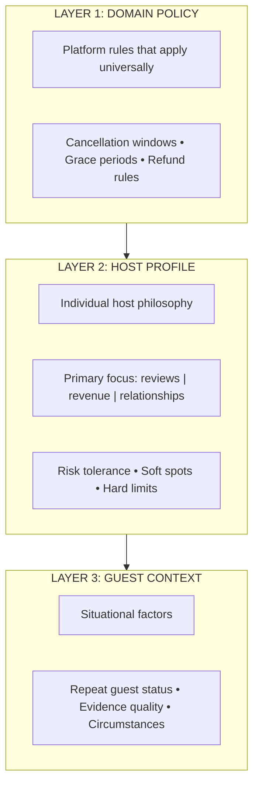
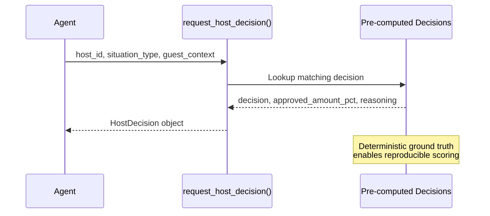
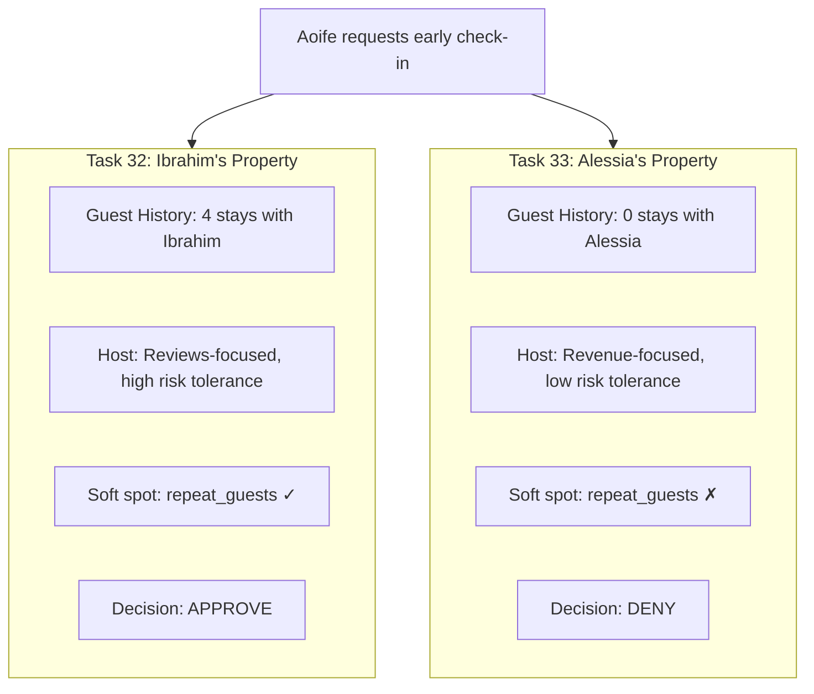
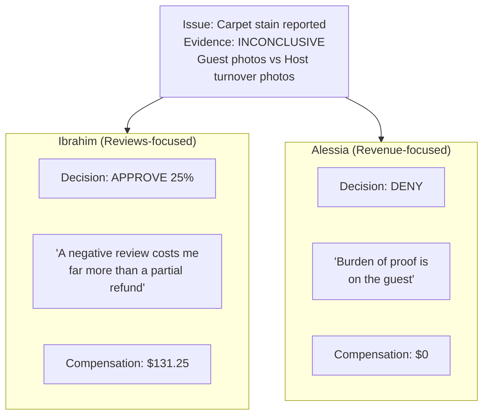

# Vacation Rental Domain

The Vacation Rental domain extends tau2-bench evaluation beyond rule application into **preference adaptation**. By introducing host profiles as a decision layer, we test whether agents truly understand and act on human preferences—not just follow policies.

## The Three-Layer Decision Model

This domain introduces a three-layer decision model that goes beyond simple policy lookup:

The Vacation Rental domain uniquely tests **Layer 2**: can agents adapt to different human preferences when given the same situation?

## Host Profile Archetypes

The domain includes three distinct host profiles that represent real-world hosting philosophies:

| Host | Philosophy | Risk Tolerance | Max Goodwill Refund | Key Soft Spots |
|------|------------|----------------|---------------------|----------------|
| **Ibrahim** | Reviews-first | High | 50% | Medical emergencies, repeat guests, honest communication |
| **Alessia** | Revenue-first | Low | 0% | Repeat guests only |
| **Pierre** | Relationships | Medium | 25% | Military service, first responders, honest mistakes |

These profiles create **divergent correct answers** for identical scenarios.

## Grounding Evaluation with Pre-Computed Host Decisions

To ensure deterministic evaluation, host decisions are pre-computed and stored as ground truth:

This design ensures:
- **Deterministic scoring:** Expected outcomes are pre-defined and grounded
- **Psychology simulation:** The reasoning field captures different host preferences
- **Testable preference adaptation:** Same input + different host = different correct answer

## Example: Same Request, Different Hosts, Different Outcomes

### Setup: Early Check-In Request

| Variable | Value |
|----------|-------|
| Guest | Aoife Ryan |
| Request | Early check-in (11 AM instead of 3 PM) |
| Reason | "My flight arrives early, I'd rather not wait" |

### Divergent Outcomes

### Expected Agent Tool Chain

**Task 32 (Ibrahim):**
1. `get_reservation_details(RES016)`
2. `get_listing_details(LST002)` → identifies host
3. `get_guest_history(aoife_ryan_3456)` → discovers 4 stays with Ibrahim
4. `get_host_profile(host_ibrahim_...)` → sees soft spot for repeat guests
5. `request_host_decision(..., guest_context="repeat_guest")` → **APPROVE**

**Task 33 (Alessia):**
1. `get_reservation_details(RES005)`
2. `get_listing_details(LST006)` → identifies host
3. `get_guest_history(aoife_ryan_3456)` → finds 0 stays with Alessia
4. `get_host_profile(host_alessia_...)` → sees low flexibility
5. `request_host_decision(..., guest_context=null)` → **DENY**

### Why This Matters for Evaluation

| Failure Mode | Task 32 | Task 33 |
|--------------|---------|---------|
| Agent always approves | Pass | Fail |
| Agent always denies | Fail | Pass |
| Agent skips host profile lookup | Fail | Fail |
| Agent ignores guest history | Fail | Fail |
| **Agent adapts to host preferences** | **Pass** | **Pass** |

## Disputed Evidence Scenario

This scenario shows how host psychology affects ambiguous situations:

Same evidence. Same platform policy. **Different correct answers based on host.**

## Domain Statistics

- **Users:** 8 (5 guests, 3 hosts)
- **Listings:** 8 properties across different cancellation policies
- **Reservations:** 20 bookings
- **Tasks:** 35 evaluation scenarios
- **Host Decisions:** 13 pre-computed decisions
- **Task Splits:** train (21), test (14), eval (16), base (35)

## Tools

The domain provides the following tools:

### Core Tools
- `get_user_details` - Retrieve user profile and reservations
- `get_reservation_details` - Get reservation information
- `get_listing_details` - Get listing and cancellation policy
- `get_current_time` - Get current datetime for policy calculations
- `get_cancellation_policy_rules` - Get refund calculation rules
- `calculate` - Safe arithmetic calculator
- `cancel_reservation` - Cancel with policy-based refund validation

### Host Consideration Tools
- `get_host_profile` - Retrieve host preferences and philosophy
- `get_guest_history` - Check guest's stay history by host
- `request_host_decision` - Get pre-computed host decision for situation

### Issue Handling Tools
- `submit_issue_report` - Create issue record
- `get_issue_details` - Retrieve issue information
- `validate_issue_evidence` - Check evidence validation status
- `process_goodwill_refund` - Issue refund beyond policy (with host limits)
- `apply_service_credit` - Apply credit to guest account
- `add_reservation_note` - Document decisions

### Escalation
- `transfer_to_human_agents` - Escalate to human support
