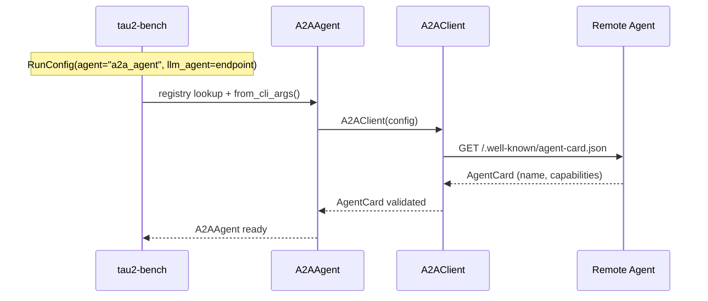
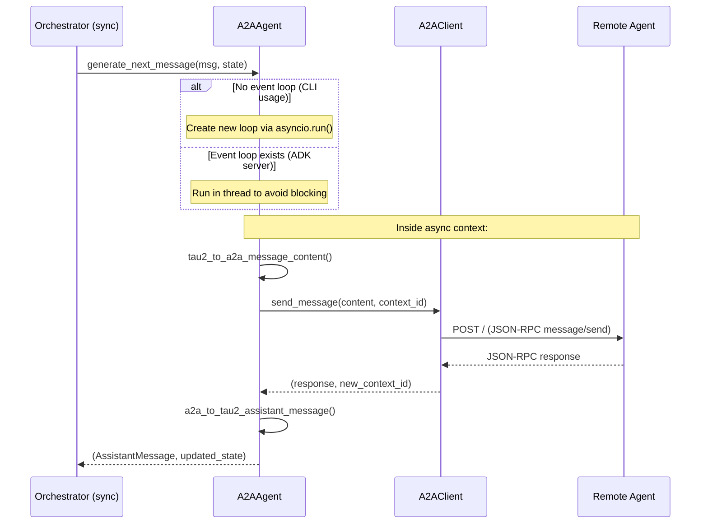

# Quickstart: tau2-agent A2A Integration

This guide covers running A2A evaluations and explains how tau2-bench was agentified using [Google ADK](https://github.com/google/adk-python) and the [A2A Protocol](https://a2a-protocol.org/latest/).

---

## Table of Contents

1. [Environment Setup](#environment-setup)
2. [Quick Start](#quick-start)
3. [Architecture Overview](#architecture-overview)
4. [A2A + ADK Flow Diagrams](#a2a--adk-flow-diagrams)
5. [How tau2-bench was Agentified](#how-tau2-bench-was-agentified)
6. [Troubleshooting](#troubleshooting)
7. [References](#references)

---

## Environment Setup

```bash
# 1. Python 3.10+ required
python -m venv venv && source venv/bin/activate
pip install -e .

# 2. Configure API keys
cp .env.example .env
# Edit .env - NEBIUS_API_KEY is required (get from https://tokenfactory.nebius.com/)
```

---

## Quick Start

### 1. Start ADK Server

```bash
adk api_server --a2a . --port 8001
```

### 2. Verify Agents (new terminal)

```bash
# tau2_agent (evaluator)
curl -s http://localhost:8001/a2a/tau2_agent/.well-known/agent-card.json | jq .name
# → "tau2_eval_agent"

# simple_nebius_agent (evaluatee)
curl -s http://localhost:8001/a2a/simple_nebius_agent/.well-known/agent-card.json | jq .name
# → "simple_nebius_agent"
```

### 3. Run Platform Simulation

```bash
python specs/001-a2a-integration/scripts/platform_simulation.py --domain mock --num-tasks 1
```

### Other Options

**Domain Evaluation:**
```bash
./specs/001-a2a-integration/scripts/eval_domain.sh telecom 1 5  # domain, trials, tasks
```

**Tests:**
```bash
pytest tests/test_a2a_client/ -v                    # Unit tests (mocked)
pytest tests/test_local_eval/ -v -m "local_agent"   # E2E (requires server)
```

---

## Architecture Overview

tau2-agent transforms tau2-bench into an A2A-accessible evaluation service.

```
┌─────────────────────────────────────────────────────────────────────────────┐
│                           tau2-agent Architecture                           │
├─────────────────────────────────────────────────────────────────────────────┤
│                                                                             │
│   External Clients                      tau2-agent (ADK Server)             │
│   ┌─────────────┐                       ┌──────────────────────────────┐   │
│   │  Platform   │─── A2A JSON-RPC ────▶│  tau2_agent (LlmAgent)        │   │
│   │  or Client  │                       │  ├─ run_tau2_evaluation tool  │   │
│   └─────────────┘                       │  ├─ list_domains tool         │   │
│         ▲                               │  └─ get_evaluation_results    │   │
│         │                               └──────────────────────────────┘   │
│         │                                         │                         │
│   A2A Response                                    │ (internal)             │
│   (results)                                       ▼                         │
│                                         ┌──────────────────────────────┐   │
│   ┌─────────────┐                       │  tau2-bench Evaluation       │   │
│   │  Agent      │◀─── A2A JSON-RPC ────│  ├─ Orchestrator             │   │
│   │  (evaluatee)│                       │  ├─ User Simulator           │   │
│   └─────────────┘                       │  └─ Domain Environment       │   │
│                                         └──────────────────────────────┘   │
│                                                                             │
└─────────────────────────────────────────────────────────────────────────────┘
```

### Architecture Transformation

**Before (CLI only):**
```
User → tau2 CLI → LLM Agent → Domain Environment → Results
```

**After (A2A enabled):**
```
                    ┌──────────────────────────────────────────┐
                    │  ADK Server (A2A Protocol)               │
                    │  ┌─────────────────────────────────────┐ │
Any A2A Client ────▶│  │ tau2_agent                          │ │
                    │  │   Tools:                            │ │
                    │  │   - run_tau2_evaluation             │ │
                    │  │   - list_domains                    │ │
                    │  │   - get_evaluation_results          │ │
                    │  └───────────────┬─────────────────────┘ │
                    │                  │                        │
                    │                  ▼                        │
                    │  ┌─────────────────────────────────────┐ │
                    │  │ tau2-bench evaluation engine        │ │
                    │  └───────────────┬─────────────────────┘ │
                    │                  │                        │
                    │                  ▼                        │
                    │  ┌─────────────────────────────────────┐ │
                    │  │ A2AAgent (evaluates remote agents)  │ │
                    │  └─────────────────────────────────────┘ │
                    └──────────────────────────────────────────┘
                                       │
                                       ▼
                         Remote A2A Agent (evaluatee)
```

---

## A2A + ADK Flow Diagrams

### 1. Agent Discovery



### 2. Message Exchange

A2AAgent bridges tau2's sync interface with async HTTP:



### 3. Platform Simulation


### 4. Tool Execution (Local)

Tools execute in tau2-bench, not on the remote agent:


---

## How tau2-bench was Agentified

### Key Components

| Component | File | Purpose |
|-----------|------|---------|
| `tau2_agent` | [tau2_agent/agent.py](../../tau2_agent/agent.py) | ADK LlmAgent exposing tau2 tools |
| `A2AAgent` | [src/tau2/agent/a2a_agent.py](../../src/tau2/agent/a2a_agent.py) | Adapter for evaluating A2A agents |
| `A2AClient` | [src/tau2/a2a/client.py](../../src/tau2/a2a/client.py) | HTTP client for A2A protocol |
| `translation` | [src/tau2/a2a/translation.py](../../src/tau2/a2a/translation.py) | tau2 <-> A2A message conversion |

### ADK Integration

```python
from google.adk.agents import LlmAgent
from google.adk.models.lite_llm import LiteLlm

root_agent = LlmAgent(
    name="tau2_eval_agent",
    model=LiteLlm(model="nebius/Qwen/Qwen3-30B-A3B-Thinking-2507", ...),
    after_model_callback=parse_text_tool_call,  # Text-based tool calls
    tools=[RunTau2Evaluation, ListDomains, GetEvaluationResults],
)
```

**Key ADK features used:**
- `LlmAgent` - Core agent abstraction
- `LiteLlm` - Multi-provider LLM support
- `after_model_callback` - Enables text-based tool calling for models without native function calling

### A2A Protocol Implementation

1. **Discovery**: `/.well-known/agent-card.json` endpoint
2. **Messaging**: JSON-RPC 2.0 with `message/send` method
3. **Context**: Server-generated `context_id` for multi-turn conversations
4. **Compatibility**: Supports 5 different A2A response formats

---

## Troubleshooting

| Issue | Solution |
|-------|----------|
| Port in use | `kill $(lsof -t -i:8001)` |
| API key not set | `source .env` or `export $(grep -v '^#' .env \| xargs)` |
| Discovery fails | `curl http://localhost:8001/a2a/tau2_agent/.well-known/agent-card.json` |
| Timeout | Add `--agent-a2a-timeout 600` to tau2 command |

---

## References

- [A2A Protocol Spec](https://a2a-protocol.org/latest/) | [a2a-python SDK](https://github.com/a2aproject/a2a-python)
- [Google ADK](https://github.com/google/adk-python)
- [tau2-bench](https://github.com/sierra-research/tau2-bench)
