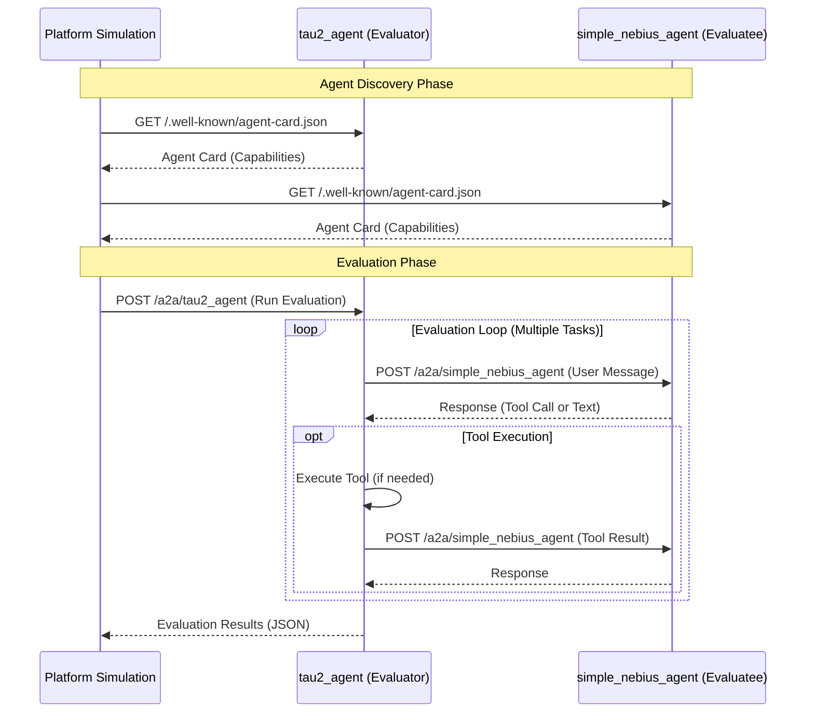
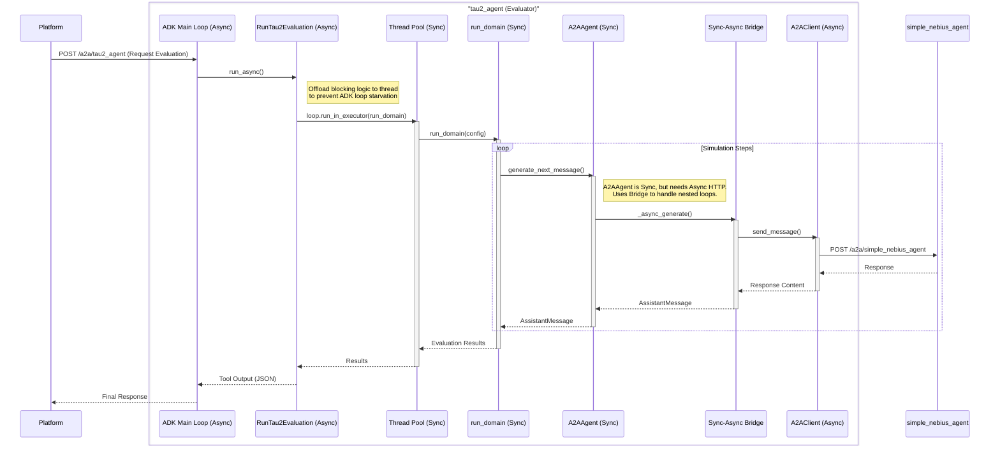
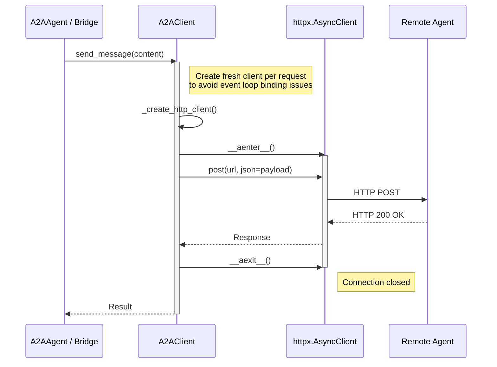

# tau2-bench Evaluation Sequence Diagrams

This document illustrates the sequence of interactions for `tau2-bench` evaluations, focusing on the A2A (Agent-to-Agent) integration, sync-async bridges, and threading models.

## High-Level Overview

This diagram shows the overall flow where a Platform (or User) requests an evaluation from `tau2_agent`, which then orchestrates the evaluation by communicating with the Evaluatee (e.g., `simple_nebius_agent`) via A2A.

## Detailed Flow: Sync-Async Bridge & Threading

This diagram details the internal architecture, highlighting how `tau2_agent` handles the synchronous `tau2-bench` core logic within an asynchronous ADK environment using threading and sync-async bridges.

**Key Components:**
*   **ADK Main Loop**: The asynchronous event loop handling incoming HTTP requests.
*   **RunTau2Evaluation**: The tool implementation that bridges to the synchronous domain runner.
*   **Thread Pool**: Used to run the blocking `run_domain` logic without freezing the ADK server.
*   **A2AAgent**: The synchronous agent wrapper used by `tau2-bench`.
*   **Sync-Async Bridge**: A mechanism in `A2AAgent` to call async HTTP clients from synchronous code.

## A2A Client Connection Lifecycle

This diagram shows how `A2AClient` manages HTTP connections to ensure reliability and avoid event loop conflicts.

